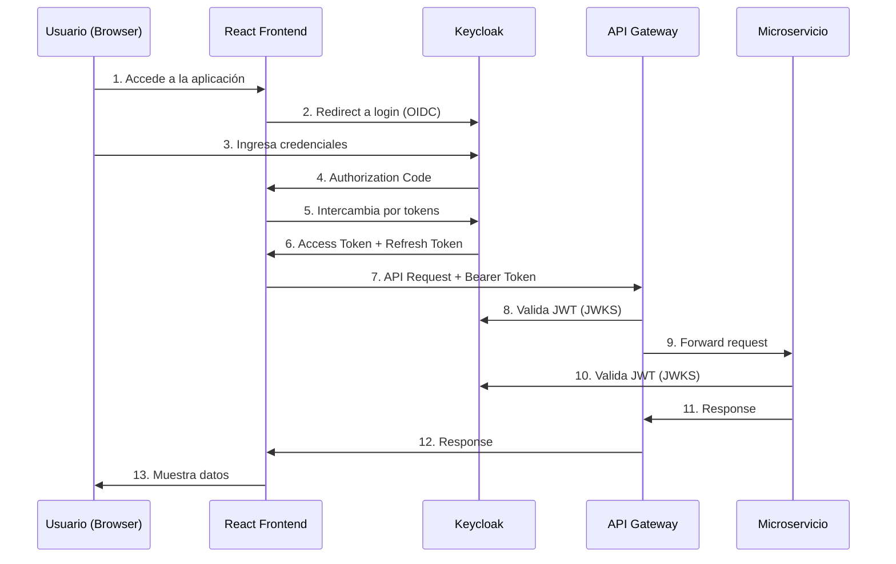
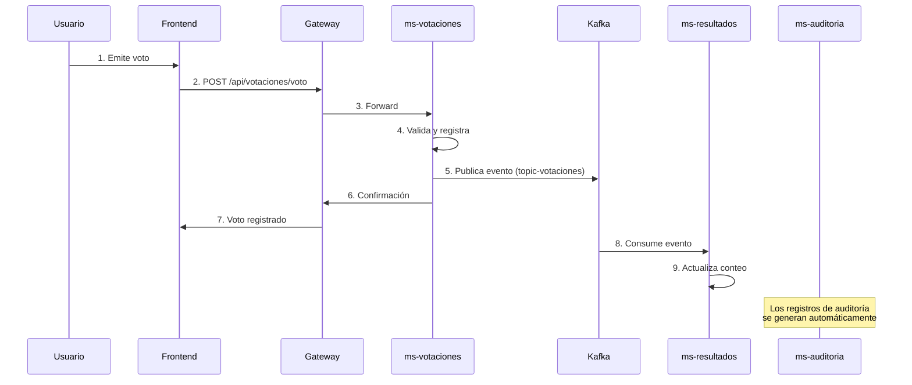

# Diagrama de Arquitectura y Comunicación de Microservicios

## Sistema de Digitalización de Elecciones Bolivianas

Este diagrama muestra la arquitectura completa del sistema, incluyendo el Gateway, Config Server, Discovery (Eureka), todos los microservicios, bases de datos, Keycloak y la mensajería Kafka.

---

## Diagrama de Componentes

```mermaid
flowchart TB
    subgraph Usuario
        Browser["👤 Usuario (Browser)"]
    end

    subgraph Frontend["«Frontend» React Frontend"]
        ReactApp["React Frontend<br/>(localhost:5173)"]
    end

    subgraph Gateway["«Spring Boot» API Gateway"]
        GW["Gateway / Edge Server<br/>api-gateway<br/>(localhost:8080)"]
    end

    subgraph Microservicios["Microservicios Spring Boot"]
        MS_USR["«Spring Boot»<br/>ms-usuarios<br/>(8081)"]
        MS_CAND["«Spring Boot»<br/>ms-candidatos<br/>(8082)"]
        MS_VOT["«Spring Boot»<br/>ms-votaciones<br/>(8083)"]
        MS_AUD["«Spring Boot»<br/>ms-auditoria<br/>(8085)"]
        MS_RES["«Spring Boot»<br/>ms-resultados-estadisticas<br/>(8086)"]
        MS_NOT["«Spring Boot»<br/>ms-notificaciones"]
    end

    subgraph BaseDatos["Bases de Datos PostgreSQL"]
        DB_USR[("«Database»<br/>usuarios_db<br/>(PostgreSQL:5432)")]
        DB_CAND[("«Database»<br/>candidatos_db<br/>(PostgreSQL:5434)")]
        DB_VOT[("«Database»<br/>votaciones_db<br/>(PostgreSQL:5433)")]
        DB_AUD[("«Database»<br/>auditoria_db<br/>(PostgreSQL:5435)")]
        DB_RES[("«Database»<br/>resultados_db<br/>(PostgreSQL:5436)")]
    end

    subgraph Infraestructura["Infraestructura"]
        KC["«Infra»<br/>Keycloak (IdP)<br/>(localhost:8090)"]
        EUR["«Config»<br/>Discovery<br/>Eureka Server<br/>(localhost:8761)"]
        CFG["«Config»<br/>Config Server<br/>(localhost:8888)"]
    end

    subgraph Mensajeria["Mensajería"]
        KAFKA["«Messaging»<br/>Apache Kafka<br/>(9092)"]
        ZK["«Messaging»<br/>Zookeeper<br/>(2181)"]
    end

    subgraph KeycloakDB["Base de Datos Keycloak"]
        DB_KC[("«Database»<br/>keycloak<br/>(PostgreSQL)")]
    end

    %% Flujo Usuario
    Browser -->|"1) Navega / Usa UI"| ReactApp
    ReactApp -->|"2) Login/Auth (OIDC)<br/>Authorization Code + PKCE"| KC
    ReactApp -->|"3) API Requests<br/>(Bearer Token)"| GW

    %% Gateway a Microservicios
    GW -->|"/api/usuarios/**"| MS_USR
    GW -->|"/ms-candidatos/**"| MS_CAND
    GW -->|"/api/votaciones/**"| MS_VOT
    GW -->|"/api/auditoria/**"| MS_AUD
    GW -->|"/api/resultados/**"| MS_RES
    GW -->|"/ms-notificaciones/**"| MS_NOT

    %% Microservicios a Bases de Datos
    MS_USR --> DB_USR
    MS_CAND --> DB_CAND
    MS_VOT --> DB_VOT
    MS_AUD --> DB_AUD
    MS_RES --> DB_RES

    %% Validación JWT
    MS_USR -.->|"Valida JWKS"| KC
    MS_CAND -.->|"Valida JWKS"| KC
    MS_VOT -.->|"Valida JWKS"| KC
    MS_AUD -.->|"Valida JWKS"| KC
    MS_RES -.->|"Valida JWKS"| KC
    GW -.->|"Valida JWKS"| KC

    %% Registro en Eureka
    MS_USR -.->|"Se registra"| EUR
    MS_CAND -.->|"Se registra"| EUR
    MS_VOT -.->|"Se registra"| EUR
    MS_AUD -.->|"Se registra"| EUR
    MS_RES -.->|"Se registra"| EUR
    MS_NOT -.->|"Se registra"| EUR
    GW -.->|"Descubre servicios"| EUR

    %% Carga Configuración
    MS_USR -.->|"Carga Config"| CFG
    MS_VOT -.->|"Carga Config"| CFG
    MS_AUD -.->|"Carga Config"| CFG
    MS_RES -.->|"Carga Config"| CFG

    %% Kafka
    MS_VOT -->|"Publica votos"| KAFKA
    MS_RES -->|"Consume votos"| KAFKA
    MS_USR -->|"Eventos usuarios"| KAFKA
    MS_NOT -->|"Consume eventos"| KAFKA
    ZK --- KAFKA

    %% Keycloak DB
    KC --> DB_KC

    %% Estilos
    classDef frontend fill:#e74c3c,stroke:#c0392b,color:#fff
    classDef gateway fill:#27ae60,stroke:#1e8449,color:#fff
    classDef microservice fill:#3498db,stroke:#2980b9,color:#fff
    classDef database fill:#f39c12,stroke:#d68910,color:#fff
    classDef infra fill:#e67e22,stroke:#d35400,color:#fff
    classDef config fill:#1abc9c,stroke:#16a085,color:#fff
    classDef messaging fill:#9b59b6,stroke:#8e44ad,color:#fff

    class ReactApp frontend
    class GW gateway
    class MS_USR,MS_CAND,MS_VOT,MS_AUD,MS_RES,MS_NOT microservice
    class DB_USR,DB_CAND,DB_VOT,DB_AUD,DB_RES,DB_KC database
    class KC infra
    class EUR,CFG config
    class KAFKA,ZK messaging
```

---

## Leyenda de Colores

| Color                 | Tipo                           |
| --------------------- | ------------------------------ |
| 🔴 **Rojo**           | Frontend (React)               |
| 🟢 **Verde**          | Gateway (Spring Cloud Gateway) |
| 🔵 **Azul**           | Microservicios (Spring Boot)   |
| 🟠 **Naranja**        | Base de Datos (PostgreSQL)     |
| 🟤 **Naranja Oscuro** | Infraestructura (Keycloak)     |
| 🟦 **Verde Agua**     | Config/Discovery               |
| 🟣 **Púrpura**        | Mensajería (Kafka)             |

---

## Componentes del Sistema

### Frontend

- **React Frontend** (localhost:5173): Interfaz de usuario para votantes, jurados y administradores

### API Gateway

- **api-gateway** (localhost:8080): Punto de entrada único para todas las peticiones API

### Microservicios

| Servicio                       | Puerto | Base de Datos        | Descripción                       |
| ------------------------------ | ------ | -------------------- | --------------------------------- |
| **ms-usuarios**                | 8081   | usuarios_db (5432)   | Gestión de usuarios y roles       |
| **ms-candidatos**              | 8082   | candidatos_db (5434) | Gestión de candidatos y partidos  |
| **ms-votaciones**              | 8083   | votaciones_db (5433) | Registro y validación de votos    |
| **ms-auditoria**               | 8085   | auditoria_db (5435)  | Logs y registros de auditoría     |
| **ms-resultados-estadisticas** | 8086   | resultados_db (5436) | Conteo y estadísticas             |
| **ms-notificaciones**          | -      | -                    | Envío de notificaciones por email |

### Infraestructura y Configuración

| Servicio          | Puerto | Función                         |
| ----------------- | ------ | ------------------------------- |
| **Keycloak**      | 8090   | Identity Provider (OIDC/OAuth2) |
| **Eureka Server** | 8761   | Service Discovery               |
| **Config Server** | 8888   | Configuración centralizada      |
| **Apache Kafka**  | 9092   | Mensajería asíncrona            |
| **Zookeeper**     | 2181   | Coordinación de Kafka           |

---

## Flujo de Autenticación

---

## Flujo de Votación

---

## Rutas del API Gateway

| Ruta                    | Servicio Destino       | Descripción               |
| ----------------------- | ---------------------- | ------------------------- |
| `/api/usuarios/**`      | usuarios-service       | Gestión de usuarios       |
| `/ms-usuarios/**`       | usuarios-service       | Ruta alternativa          |
| `/ms-candidatos/**`     | candidatos             | Gestión de candidatos     |
| `/api/votaciones/**`    | votaciones-service     | Operaciones de voto       |
| `/api/auditoria/**`     | auditoria-service      | Logs de auditoría         |
| `/api/resultados/**`    | resultados-service     | Resultados y estadísticas |
| `/ms-notificaciones/**` | notificaciones-service | Notificaciones            |

---

## Imágenes de Referencia

### Diagrama de Ejemplo (Criterios de Evaluación)

### Criterios de Evaluación

---

## Cumplimiento de Criterios

✅ **Sistema funcional**: La aplicación está desplegada y funcionando via Docker Compose

✅ **Gateway**: API Gateway (Spring Cloud Gateway) en puerto 8080

✅ **Config Server**: Configuración centralizada en puerto 8888

✅ **Discovery**: Eureka Server en puerto 8761

✅ **Todos los microservicios**: 6 microservicios (usuarios, candidatos, votaciones, auditoria, resultados, notificaciones)

✅ **Base de datos**: 6 bases de datos PostgreSQL independientes

✅ **Keycloak**: Identity Provider con OAuth2/OIDC
